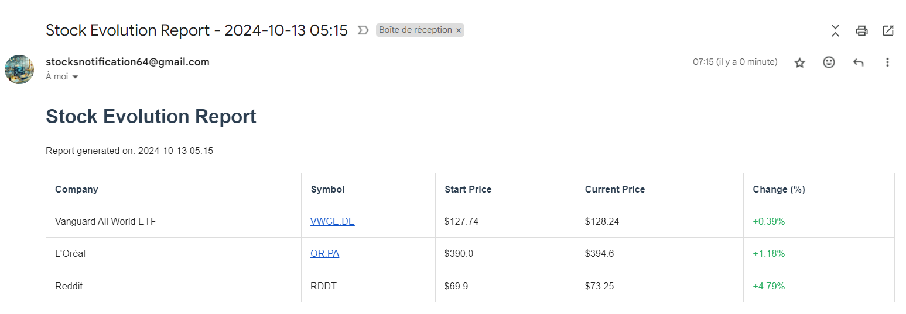

# Stock Tracker AWS Project

This project is an automated stock tracking system built on AWS. It fetches stock prices at regular intervals and sends periodic email reports summarizing stock performance.

## Example
Here is an example of the mail that the code send everyday



## Architecture


The system consists of the following components:

1. **AWS Lambda Functions**:
   - `stock_fetcher`: Retrieves current stock prices every 10 minutes.
   - `stock_reporter`: Generates and sends email reports every 6 hours.

2. **Amazon RDS**: Stores the fetched stock data.

3. **Amazon SES**: Sends email reports.

4. **Amazon CloudWatch**: Schedules Lambda function executions and manages logs.

## Setup

1. Clone this repository:
   ```
   git clone https://github.com/yourusername/stock-tracker-aws.git
   cd stock-tracker-aws
   ```

2. Set up AWS services:
   - Create an AWS account if you don't have one.
   - Set up Amazon RDS with MySQL.
   - Configure Amazon SES for sending emails.
   - Create IAM roles for Lambda functions with necessary permissions.

3. Create deployment packages for Lambda functions:
   ```
   python create_lambda_package.py
   ```

4. Deploy Lambda functions:
   - Upload the generated ZIP files to AWS Lambda.
   - Set environment variables for database connection and email settings.

5. Configure CloudWatch Events:
   - Create a rule to trigger `stock_fetcher` every 10 minutes.
   - Create a rule to trigger `stock_reporter` every 6 hours.

## Usage

Once set up, the system will automatically:

- Fetch stock prices every 10 minutes and store them in the RDS database.
- Generate and send email reports every 6 hours with stock performance data.

## Configuration

Edit the `SYMBOLS` dictionary in `stock_fetcher_aws.py` to track different stocks:

```python
SYMBOLS = {
    'VWCE.DE': 'Vanguard All World ETF',
    'OR.PA': "L'Oréal",
    "RDDT": 'Reddit'
}
```

## Contributing

Contributions are welcome! Please feel free to submit a Pull Request.

## License

This project is licensed under the MIT License - see the [LICENSE](LICENSE) file for details.
